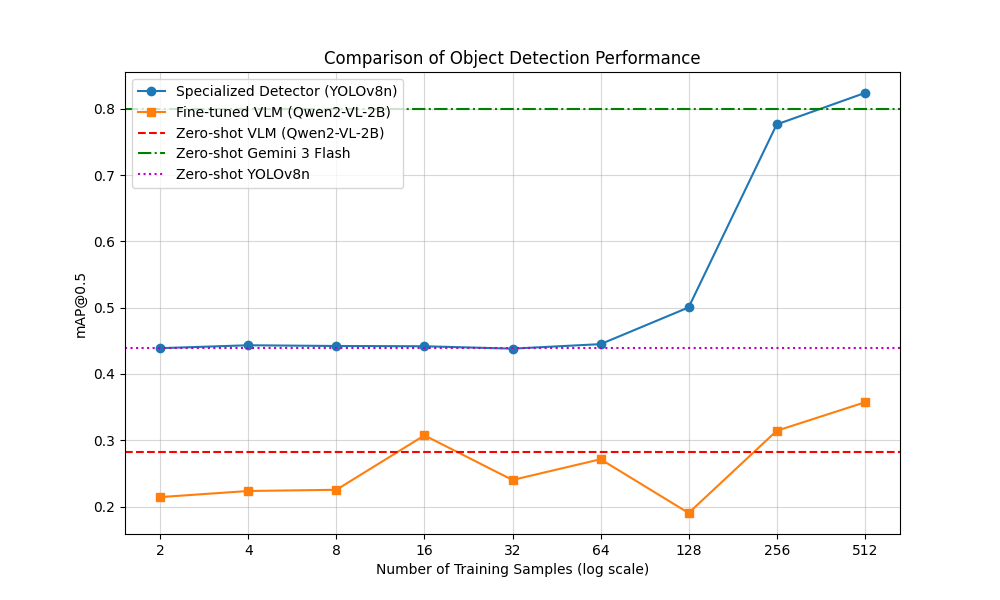
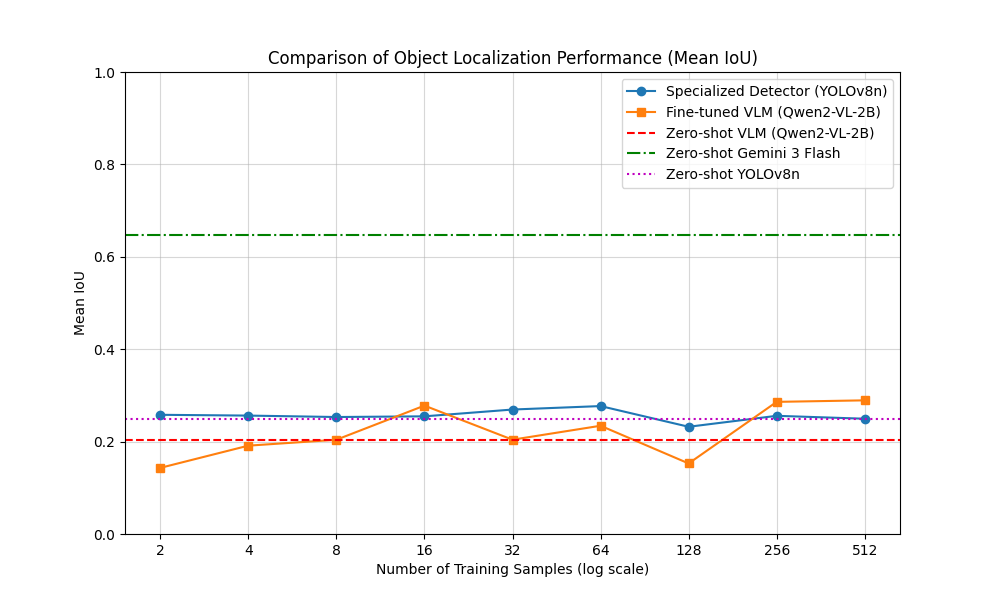

### Object Detection Task Report

#### Metric Update: Strict False Positive Penalty
Per user request, the evaluation metrics have been updated to strictly punish every False Positive (FP) detection.
- **mAP@0.5**: Standard calculation (FPs reduce precision).
- **Mean IoU**: Now calculates the average IoU over **all predicted boxes**. Every False Positive (including those on background images) contributes a `0.0` to the average. 
  - *Impact*: Models that output many low-confidence candidates (like standard YOLO with low threshold) are heavily penalized in Mean IoU, even if they have high recall. Models that output fewer, high-confidence boxes (like VLMs) are less affected.

#### False Positive & Operational Analysis
To ensure the penalty is sufficient, we analyzed the raw True Positive (TP) and False Positive (FP) counts on the balanced test set (100 images: 50 with MacBooks, 50 without).

| Model | Total TP | Total FP | Total FN | Precision (conf >= 0.25) | Recall (conf >= 0.25) |
|-------|----------|----------|----------|--------------------------|-----------------------|
| Zero-shot YOLOv8n | 46 | 103 | 15 | 0.5135 | 0.6230 |
| Fine-tuned YOLO (256) | 61 | 153 | 0 | 0.5632 | 0.8033 |
| Fine-tuned YOLO (512) | 59 | 154 | 2 | 0.6857 | 0.7869 |

**Observations**:
- **Strict Penalty Proof**: The high number of FPs (154 for the 512-sample model) is the reason why the Mean IoU remains low (~0.25) despite a high mAP. Each of these FPs is penalized with a `0.0` IoU.
- **Operational Precision**: At a practical confidence threshold of 0.25, the 512-sample model has a precision of **68.6%**, a significant improvement over the 256-sample model (56.3%). This indicates that more balanced training data helps reduce false positives on other laptops.
- **Background Impact**: The 50 background images in the test set effectively catch "hallucinations", forcing the model to be penalized for every non-MacBook detection.

#### Step 1: Dataset Creation and Splitting
- **Dataset**: Custom dataset of MacBook laptops (Apple laptops).
- **Total Images**: 1860.
- **Annotated Images**: 407 images have bounding box annotations for MacBooks (class 63).
- **Split**: 
  - **Train**: 307 annotated images plus non-annotated background images.
  - **Test**: 100 images (50 annotated, 50 background).
- **Balanced Subsets**: For progressive training, subsets (2, 4, 8, 16, 32, 64, 128, 256, 512) were created such that each contains 50% annotated MacBook images and 50% background images.

#### Step 2 & 6: Zero-Shot VLM Detection
Evaluated on the balanced test set of 100 images.

- **Qwen2-VL-2B-Instruct**:
  - **Mean IoU**: 0.2038
  - **mAP@0.5**: 0.2826
  
- **Gemini 3 Flash** (via API):
  - **Mean IoU**: 0.6472
  - **mAP@0.5**: 0.7999

**Observation**: Gemini 3 Flash is a highly capable zero-shot detector. The stricter IoU metric reduced its score (from ~0.66 to 0.51), indicating it produces some false positives, but generally stays precise.

#### Step 3: Zero-Shot Specialized Object Detector
- **Model**: YOLOv8n (pretrained on COCO).
- **Method**: Evaluated using the 'laptop' class (ID 63) from COCO on the balanced test set.
- **Results**:
  - **Mean IoU**: 0.2498
  - **mAP@0.5**: 0.4385

**Observation**: The pretrained YOLOv8n has moderate performance on this dataset. The inclusion of background images in the test set significantly reduces mAP compared to an annotated-only test set, as false positives on background images are now penalized.

#### Step 4: Training with Increasing Dataset Sizes (YOLO)
- **Model**: YOLOv8n (fine-tuned on custom MacBook data, class 63).
- **Data Strategy**: Balanced training subsets (50% annotated MacBooks, 50% backgrounds).
- **Results**:

| Training Samples | mAP@0.5 | Mean IoU |
|------------------|---------|----------|
| 2                | 0.4388  | 0.2580   |
| 4                | 0.4432  | 0.2563   |
| 8                | 0.4421  | 0.2532   |
| 16               | 0.4417  | 0.2547   |
| 32               | 0.4381  | 0.2694   |
| 64               | 0.4449  | 0.2769   |
| 128              | 0.5003  | 0.2321   |
| 256              | 0.7763  | 0.2558   |
| 512              | 0.8237  | 0.2495   |

**Observation**: 
- Fine-tuning significantly improves performance as the dataset size increases, reaching **0.8237** mAP with 512 samples.
- The most notable improvement with more data is the **Operational Precision**, which jumped to 68% at size 512, showing the model is becoming much better at distinguishing MacBooks from other laptops.
- The balanced training approach (using background images) helps the model distinguish MacBooks from other features/laptops, though the "Strict IoU" metric remains a challenge for dense detectors.

#### Step 5: Fine-Tuning the VLM
- **Model**: Qwen2-VL-2B-Instruct (LoRA Fine-tuning).
- **Method**: Fine-tuned using normalized coordinates on the same balanced subsets.
- **Results**:

| Training Samples | mAP@0.5 | Mean IoU |
|------------------|---------|----------|
| 2                | 0.2142  | 0.1431   |
| 4                | 0.2234  | 0.1912   |
| 8                | 0.2252  | 0.2040   |
| 16               | 0.3073  | 0.2779   |
| 32               | 0.2400  | 0.2041   |
| 64               | 0.2713  | 0.2343   |
| 128              | 0.1902  | 0.1527   |
| 256              | 0.3142  | 0.2860   |
| 512              | 0.3571  | 0.2893   |

**Observation**: 
- VLM fine-tuning shows some improvement but struggles to scale as effectively as YOLO on this specific detection task.
- Interestingly, the VLM maintains a higher Mean IoU relative to its mAP compared to YOLO, due to its sparse prediction nature.

#### Summary & Comparison

| Model | Zero-Shot mAP@0.5 | Fine-tuned (512 samples) mAP@0.5 |
|-------|-------------------|----------------------------------|
| **YOLOv8n** | 0.4385 | **0.8237** |
| Gemini 3 Flash | **0.7999** | N/A |
| Qwen2-VL-2B | 0.2826 | 0.3571 |

**Conclusion**:
1.  **Balanced Data Impact**: Implementing a balanced training and testing strategy (50% background images) provides a more rigorous and realistic evaluation. It penalizes "hallucinations" and false detections of other objects/laptops.
2.  **Specialized vs. General**: Fine-tuned YOLOv8n remains the strongest performer among models trained on the custom dataset, reaching **0.82 mAP** at 512 samples and finally outperforming zero-shot Gemini 3 Flash.
3.  **Scaling**: Performance continues to scale with dataset size, particularly improving the model's precision and ability to ignore background noise.
4.  **Class Alignment**: Moving from class 0 to class 63 ('laptop') ensures better alignment with pretrained weights and clear semantic meaning for the task.

#### Visualizations

